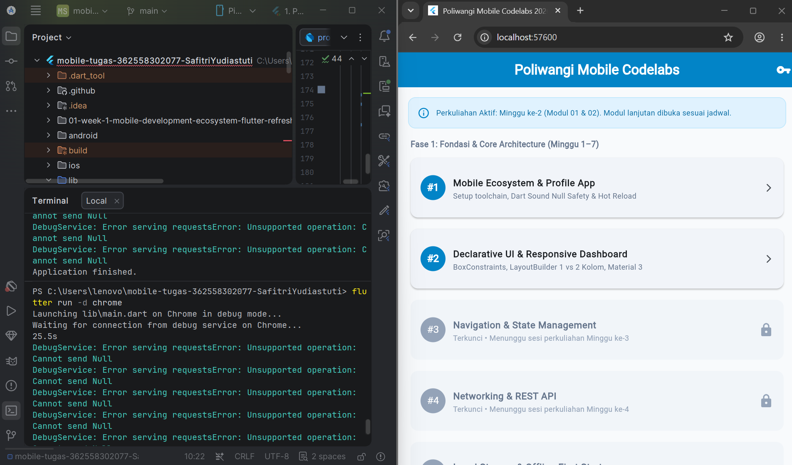
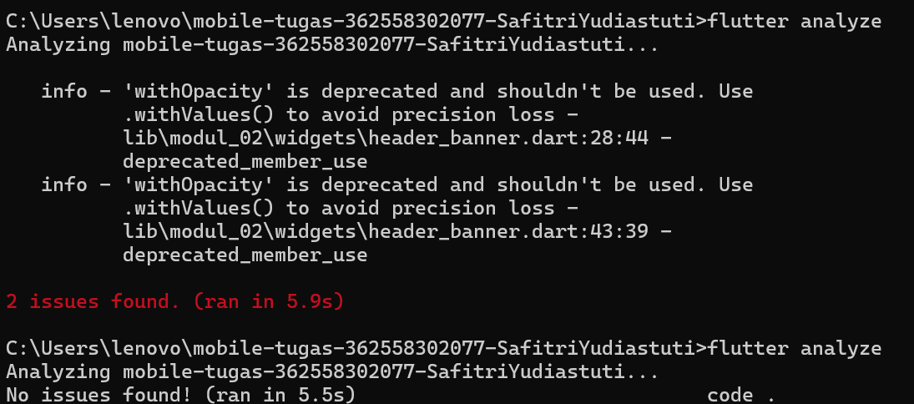

# Laporan Praktikum Modul 01: Mobile Ecosystem, Flutter Setup & Profile App

- **Nama**: Jihad Akbar
- **NIM**: 362558302003
- **Kelas / Prodi**: 2E / Sarjana Terapan TRPL
- **Mata Kuliah**: Pemrograman Perangkat Bergerak (Semester 3)

---

## 1. Ringkasan Aktivitas
Pada tanggal 9 September 2026, saya melakukan praktek modul 1 praktikum, karena sebelumnya saya install jadi hanya memeriksa apakah susdah sesuai atau belum. Seperti flutter --version, flutter doctor -v. Panduan mahasiswa untuk clone repository lalu melakukan beberapa perintah menjalankan aplikasi dan melakukan perubahan di README.md. Lalu mencoba uji kode seperti perintah flutter analyze, test.

## 2. Bukti Tangkapan Layar (Running App)
[Sertakan minimal 2 screenshot bukti aplikasi profil berjalan di emulator atau HP fisik Anda]

## 3. Kendala yang Dihadapi & Solusinya
- **Kendala**: Pada flutter analyze, terdapat error yaitu withOpacity di berbagai modul
- **Solusi**: lalu diperbaiki sesuai dengan sintax yang telah diberi tahu oleh cmdnya sendiri yaitu menggunakan withValues(alpha: )

## 4. Jawaban Pertanyaan Refleksi
1. **Pilihan Native vs Flutter**: Saya memilih Flutter karena Flutter memungkinkan pengembangan aplikasi mobile dengan satu codebase yang dapat digunakan untuk berbagai platform. Selain itu, Flutter menyediakan banyak widget untuk membangun antarmuka sehingga proses pengembangan UI menjadi lebih cepat dan fleksibel dibandingkan harus membuat aplikasi secara terpisah untuk setiap platform.
2. **Prinsip UI = f(state)**: berarti tampilan antarmuka aplikasi merupakan hasil dari kondisi atau data (state) yang sedang dimiliki aplikasi. Ketika state berubah, UI akan diperbarui agar menampilkan kondisi terbaru. Prinsip ini penting dalam Flutter karena perubahan data dapat secara langsung memengaruhi tampilan yang dilihat oleh pengguna.
3. **Pentingnya Conventional Commits**: karena membuat pesan commit lebih terstruktur, konsisten, dan mudah dipahami. Dengan menggunakan format seperti feat, fix, dan docs, anggota tim dapat mengetahui jenis perubahan yang dilakukan tanpa harus melihat seluruh isi kode. Hal ini juga memudahkan proses pelacakan perubahan dan pengelolaan project, terutama ketika dikerjakan secara berkelompok.