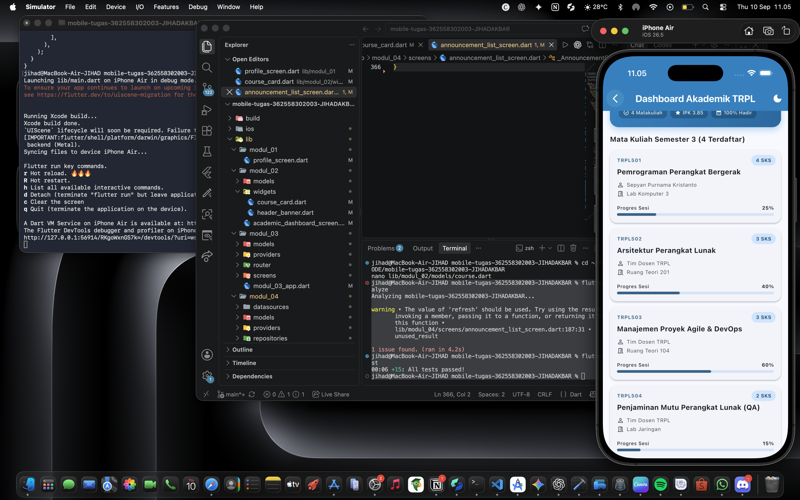
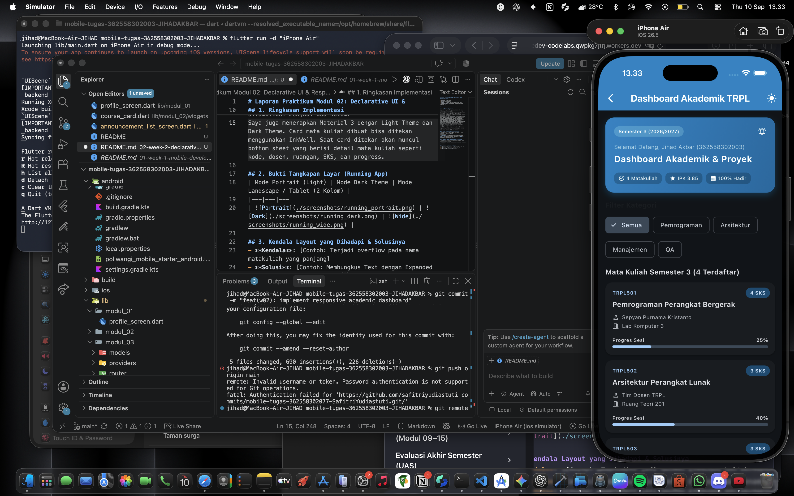
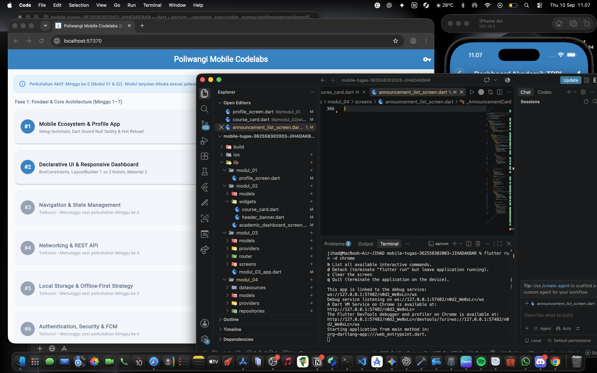

# Laporan Praktikum Modul 02: Declarative UI & Responsive Layout
- **Nama**: Jihad Akbar
- **NIM**: 362558302003
- **Kelas / Prodi**: 2E / Sarjana Terapan TRPL
- **Mata Kuliah**: Pemrograman Perangkat Bergerak (Semester 3)
---
## 1. Ringkasan Implementasi
Pada Modul 02 ini saya membuat tampilan dashboard akademik untuk mahasiswa TRPL menggunakan Flutter. Dashboard ini berisi informasi akademik seperti header, daftar mata kuliah, dosen, ruangan, SKS, dan progress mata kuliah. Tujuan dari pembuatan tampilan ini adalah untuk memahami cara membuat UI Flutter yang dapat menyesuaikan ukuran layar.
Dalam pembuatan dashboard, saya membagi beberapa bagian tampilan menjadi widget yang berbeda supaya kode lebih mudah dibaca dan tidak semuanya ditulis dalam satu file. Bagian header dibuat menggunakan `HeaderBanner`, sedangkan tampilan setiap mata kuliah dibuat menggunakan `CourseCard`. Dengan cara ini, masing-masing widget mempunyai fungsi yang lebih jelas dan lebih mudah untuk dikembangkan.
Pada `CourseCard` saya menggunakan `Stack` dan `Positioned` untuk menampilkan badge pada bagian card. Saya juga menggunakan `Row` dan `Column` untuk mengatur susunan informasi di dalam card. Pada bagian yang membutuhkan ruang fleksibel saya menggunakan `Expanded`, terutama pada teks nama dosen dan ruangan. Penggunaan `Expanded` membantu mencegah teks keluar dari batas card ketika ukuran layar lebih kecil.
Saya juga menggunakan `maxLines` dan `TextOverflow.ellipsis` pada beberapa bagian teks. Hal ini digunakan supaya teks yang terlalu panjang tidak membuat layout mengalami overflow. Dari bagian ini saya jadi lebih memahami bahwa ukuran widget di Flutter dipengaruhi oleh batas ruang yang diberikan oleh parent.
Untuk membuat dashboard menjadi responsif, saya menggunakan `LayoutBuilder`. Lebar layar digunakan sebagai acuan untuk menentukan bagaimana susunan card ditampilkan. Pada layar yang lebih kecil, card ditampilkan dalam satu kolom supaya tetap nyaman dilihat. Sedangkan pada layar yang lebih lebar, card dapat ditampilkan menjadi dua kolom sehingga ruang yang tersedia bisa digunakan dengan lebih baik.
Selain itu, saya menerapkan Material 3 menggunakan pengaturan `ThemeData` untuk Light Theme dan Dark Theme. Dengan adanya kedua tema tersebut, tampilan dashboard dapat digunakan dalam mode terang maupun gelap. Saya juga menambahkan interaksi pada card menggunakan `InkWell`. Ketika card mata kuliah ditekan, akan muncul bottom sheet yang menampilkan informasi lebih lengkap seperti kode mata kuliah, nama mata kuliah, dosen, ruangan, SKS, dan progress.
Dari implementasi ini saya dapat memahami bahwa pembuatan UI Flutter tidak hanya tentang menyusun widget, tetapi juga harus memperhatikan ukuran layar dan ruang yang tersedia. Penggunaan `Row`, `Column`, `Expanded`, `Stack`, `Positioned`, dan `LayoutBuilder` membantu membuat tampilan yang lebih fleksibel dan tidak mudah mengalami masalah ketika ukuran layar berubah.

## 2. Bukti Tangkapan Layar (Running App)
| Mode Portrait (Light) | Mode Dark Theme | Mode Landscape / Tablet (2 Kolom) |
|---|---|---|
|  |  |  |
Pada tampilan portrait, dashboard menyesuaikan dengan ukuran layar yang lebih sempit sehingga card mata kuliah ditampilkan satu kolom. Pada tampilan dark theme, seluruh tampilan mengikuti tema gelap yang sudah diterapkan melalui `ThemeData`. Sedangkan pada tampilan landscape atau layar yang lebih lebar, card dapat disusun menjadi dua kolom sehingga tampilan menjadi lebih luas dan tidak terlalu banyak ruang kosong.

## 3. Kendala Layout yang Dihadapi & Solusinya
- **Kendala**: Pada awal pembuatan dashboard terjadi `RenderFlex overflow` ketika aplikasi dijalankan pada ukuran layar yang lebih kecil. Beberapa teks dan bagian card membutuhkan ruang lebih besar daripada ruang yang tersedia.
- **Solusi**: Saya menggunakan `Expanded` pada bagian yang membutuhkan ruang fleksibel. Selain itu, teks yang cukup panjang diberi `maxLines` dan `TextOverflow.ellipsis` agar tidak keluar dari batas card.
- **Kendala**: Susunan card mata kuliah terlihat kurang sesuai ketika ukuran layar berubah. Jika hanya menggunakan ukuran yang tetap, tampilan pada layar kecil dan layar lebar akan terlihat berbeda.
- **Solusi**: Saya menggunakan `LayoutBuilder` untuk membaca lebar ruang yang tersedia. Dari lebar tersebut, jumlah kolom card disesuaikan. Layar yang lebih kecil menggunakan satu kolom, sedangkan layar yang lebih lebar menggunakan dua kolom.
- **Kendala**: Informasi pada card cukup banyak sehingga harus disusun supaya tetap rapi dan mudah dibaca.
- **Solusi**: Saya menggunakan kombinasi `Row`, `Column`, dan `Expanded` untuk membagi ruang di dalam card. Informasi yang memiliki posisi tertentu juga diatur menggunakan `Stack` dan `Positioned`.
- **Kendala**: Teks seperti nama dosen atau ruangan bisa memiliki